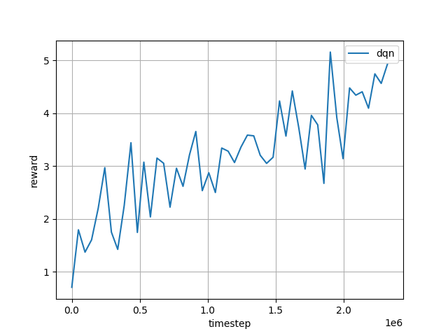
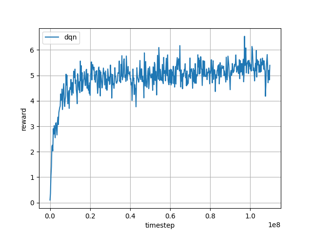
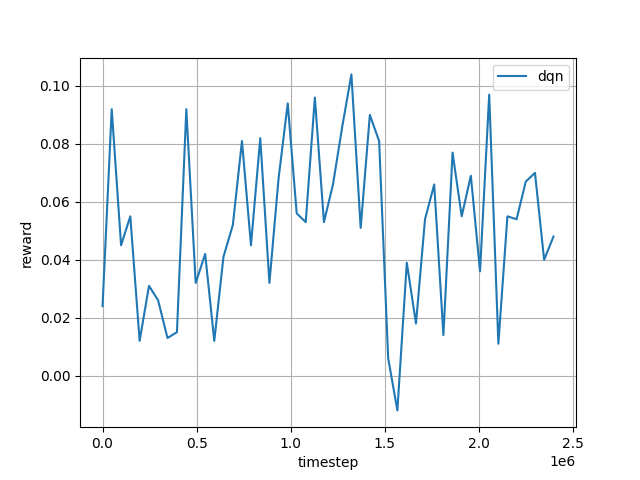
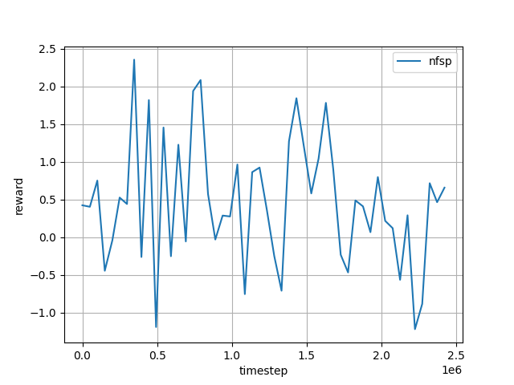

# Code Camp
## Preparation
- read [DeepStack paper](https://spencer-murray-zfht.squarespace.com/s/DeepStack.pdf)
- read [leduc tutorial](https://github.com/lifrordi/DeepStack-Leduc/blob/master/doc/manual/tutorial.md)
- try to setup [SeepStack Leduc](https://github.com/lifrordi/DeepStack-Leduc) locally (as far as you get ;-))

## Camp Agenda
- Get everyone's setup up and running
- Together, we will choose one from the following ideas
  - multiplayer mode
  - additional cards (Train with hand histories from https://www.deepstack.ai/downloads)
  - no fixed bet
  - Black Jack
  - other ideas?
- if there's time left: OXD?

## Log
### Monday
#### Mission
- Setup and basic understanding of DeepStack Leduc Holdem
#### Outcome
- DeepStack and in particular torch is [unmaintained](./01-dead-end-1-poker.md)
- we discovered RLCards and decided to continue with their repos
- RLCard installed / up and running on Windows and Linux
- Tested Leduc Holdem, Blackjack

### Tuesday
#### Mission
- Setup RLCard showdown - a graphical interface for RLCards
- Implement one of
  - Hold'em for more than two players
  - new game - e.g. MauMau as a combination of Uno with french playing cards
#### Outcome
- RLCard Showdown is an interface allowing to
  - play Dou Dizhu against computer
  - replay Leduc hold'em learning games
  - seems complicated to adjust for other / new games
- RLCard Showdown seems a bit unmaintained, some dependencies have to be adjusted to get it up and running
  - `pip install markupsafe==2.0.1`, `pip install flask==1.1.4`
  - npm seems a bit unstable for npm 8.11.0, working for npm 6.14.4
- MauMau implemented ([playing randomly](https://www.explainxkcd.com/wiki/index.php/221:_Random_Number))

### Wednesday
#### Mission
- Test and fix MauMau
- Train AI MauMau with DQN and CFR, compare
#### Outcome

##### DQN

Training DQN with adjusted payoff calculation based on card values led to a better training result.


```python
def get_payoffs(self):
    winner = self.round.winner
    if winner is not None and len(winner) == 1:
        self.payoffs[winner[0]] = 1
        self.payoffs[1 - winner[0]] = -1
    return self.payoffs
```


```python
def get_payoffs(self):
    winner = self.round.winner
    if winner is not None and len(winner) == 1:
        self.payoffs[winner[0]] = MauMauGame.weight_hand(self.players[1-winner[0]].hand)
        self.payoffs[1 - winner[0]] = -MauMauGame.weight_hand(self.players[1-winner[0]].hand)
    return self.payoffs

@staticmethod
def weight_hand(cards):
    count = 0
    for card in cards:
        if card.rank == '7': count += 7
        elif card.rank == '8': count += 8
        elif card.rank == '9': count += 9
        elif card.rank == 'T': count += 10
        elif card.rank == 'Q': count += 10
        elif card.rank == 'K': count += 10
        elif card.rank == 'A': count += 11
        elif card.rank == 'J': count += 20
    return count
```





##### NFSP

Training with NFSP on the other side is not as promising as previously seen with DQN





##### General Conclusion
- Position Matters! The stronger bot looses, if in position 2.
- Being first implies being one card ahead to player two. 

### Thursday
#### Mission
- Clean up results for short video
- Prepare first set of slides
#### Outcome
- 

### Friday
#### Mission
- Can an easy DQN trained against strong DMC beat it?
- comparison table (DQN long, DMC long, DQN trained vs. dqn long, DQN trained vs. dmc long, NFSP, random)
